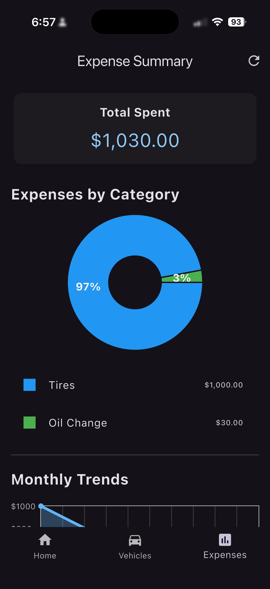
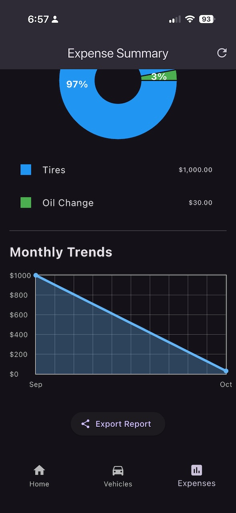

# GloveBoxx: Vehicle Maintenance Tracker

**Stop Storing Receipts In Your Car's Glove Box!**
**Never Miss Another Service Interval.**

> A cross platform mobile app built to help you manage your vehicle's maintenance history, track expenses, and get reminders for upcoming services.

  

## Features

* **Vehicle Management:** Add, edit, and delete multiple vehicles with photos.
* **Maintenance Logging:** Keep a detailed log of all service activities (oil changes, tire rotations, etc.) for each vehicle.
* **Expense Tracking:** Log the cost of each service and visualize your spending with:
    * A pie chart showing expenses by category.
    * A line chart showing spending trends over time.
* **Service Reminders:** Set reminders for upcoming maintenance and see alerts on the home screen.
* **Photo Attachments:** Attach photos of vehicles and receipts for maintenance records.
* **Data Export:** Export your complete maintenance history to a CSV file for your personal records.
* **Modern UI:**
    * Dark Mode support.
    * Intuitive slide-to-edit and delete gestures with haptic feedback.
    * Pull-to-refresh on data-heavy screens.
    * Polished layouts with custom empty-state messages.

## Tech Stack

* **Framework:** Flutter
* **Language:** Dart
* **Database:** `sqflite` for local SQLite storage.
* **State Management:** `provider` for centralized app state.
* **UI & Charts:**
    * `fl_chart` for pie and line charts.
    * `flutter_slidable` for swipe actions.
* **Utilities:**
    * `image_picker` & `path_provider` for photo handling.
    * `share_plus` & `csv` for data export.
    * `intl` for date and number formatting.

## Getting Started

To get a local copy up and running, follow these simple steps.

### Prerequisites

* You must have the Flutter SDK installed on your machine. For more information, see the [Flutter documentation](https://flutter.dev/docs/get-started/install).

### Installation

1.  Clone the repo:
    ```sh
    git clone [https://github.com/your_username/your_repository.git](https://github.com/your_username/your_repository.git)
    ```
2.  Install packages:
    ```sh
    flutter pub get
    ```
3.  Run the app:
    ```sh
    flutter run
    ```

## License

Distributed under the MIT License. See `LICENSE.txt` for more information.